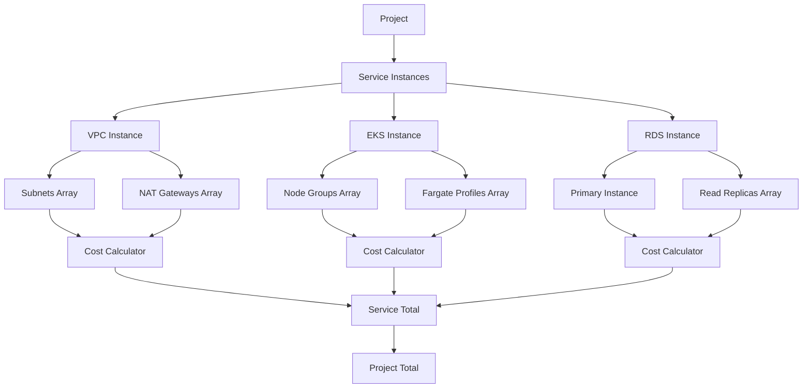

# AWS Cost Estimation UI - Production Architecture Specification

> **Document Purpose**: This is a production-grade architectural specification for building a frontend-only AWS cost estimation UI that precisely mirrors real AWS service configurations, pricing models, and dependencies.

> **Audience**: Principal Cloud Architects, Senior FinOps Engineers, Staff Frontend Platform Engineers

---

## Table of Contents

### Foundation
- [Global Design Principles](#global-design-principles)
- [Architecture Overview](#architecture-overview)
- [Global UI Patterns](#global-ui-patterns)
- [Cost Aggregation System](#cost-aggregation-system)
- [Validation Framework](#validation-framework)
- [Dependency Resolution](#dependency-resolution)

### Networking Services
- [VPC](#vpc)
- [Subnets](#subnets)
- [Internet Gateway](#internet-gateway)
- [NAT Gateway](#nat-gateway)
- [Route Tables](#route-tables)
- [VPC Endpoints](#vpc-endpoints)

### Compute Services
- [EC2](#ec2)
- [Auto Scaling Group](#auto-scaling-group)
- [Launch Template](#launch-template)
- [Application Load Balancer](#application-load-balancer)
- [Network Load Balancer](#network-load-balancer)

### Container Services
- [EKS Cluster](#eks-cluster)
- [EKS Node Groups](#eks-node-groups)
- [EKS Fargate Profiles](#eks-fargate-profiles)
- [ECS Cluster](#ecs-cluster)
- [ECS Services](#ecs-services)

### Storage Services
- [EBS](#ebs)
- [EFS](#efs)
- [S3](#s3)

### Database Services
- [RDS](#rds)
- [DynamoDB](#dynamodb)
- [ElastiCache](#elasticache)

### Serverless Services
- [Lambda](#lambda)
- [API Gateway](#api-gateway)

### Observability Services
- [CloudWatch Logs](#cloudwatch-logs)
- [CloudWatch Metrics](#cloudwatch-metrics)

---

# Global Design Principles

## Core Tenets

### 1. Service Isolation
```
✅ DO: Each service has its own schema, UI, calculator, validation
❌ DON'T: Share DEFAULT_* objects across services
❌ DON'T: Create "god objects" that handle multiple services
```

### 2. Explicit Repeatability
```
✅ DO: Use arrays for repeatable resources
✅ DO: Each child has its own lifecycle and cost
❌ DON'T: Use counters instead of actual resource arrays
```

### 3. Enforced Dependencies
```
✅ DO: Block invalid configurations
✅ DO: Show warnings for soft constraints
❌ DON'T: Assume implicit dependencies
```

### 4. Bottom-Up Cost Calculation
```
Cost Flow: Child Resource → Parent Resource → Service Total → Project Total
```

## TypeScript Conventions

```typescript
// ✅ CORRECT: Explicit IDs, no optional magic fields
interface NodeGroup {
  id: string;
  name: string;
  instanceType: string;
  capacityType: 'ON_DEMAND' | 'SPOT';
  minSize: number;
  desiredSize: number;
  maxSize: number;
  diskSize: number;
}

// ❌ WRONG: Flattened, optional magic fields
interface EKSCluster {
  nodeCount?: number; // Which node group?
  instanceType?: string; // Which node group?
}
```

---

# Architecture Overview

## System Layers



## Data Flow

### 1. Configuration Flow
```
User Input → Validation → State Update → Cost Recalculation → UI Update
```

### 2. Cost Calculation Flow
```
Leaf Resources → Parent Resources → Service Aggregation → Project Total
```

### 3. Dependency Resolution Flow
```
Service Addition → Check Dependencies → Warn/Block → Allow/Deny
```

---

# Global UI Patterns

## Card-Based Architecture

### Pattern: Service Card
```
┌─────────────────────────────────────────┐
│ [Icon] Service Name              [Cost] │
│ ─────────────────────────────────────── │
│ Configuration Summary                   │
│ • Key Metric 1                         │
│ • Key Metric 2                         │
│                                         │
│ [Edit] [Duplicate] [Delete]            │
└─────────────────────────────────────────┘
```

### Pattern: Repeatable Resource List
```
┌─────────────────────────────────────────┐
│ Resource Type (3)              [+ Add]  │
│ ─────────────────────────────────────── │
│ ┌─────────────────────────────────────┐ │
│ │ Resource #1           $XX.XX/month  │ │
│ │ Key Config Details                  │ │
│ │ [Edit] [Duplicate] [Delete]         │ │
│ └─────────────────────────────────────┘ │
│                                         │
│ ┌─────────────────────────────────────┐ │
│ │ Resource #2           $XX.XX/month  │ │
│ │ Key Config Details                  │ │
│ │ [Edit] [Duplicate] [Delete]         │ │
│ └─────────────────────────────────────┘ │
└─────────────────────────────────────────┘
```

### Pattern: Configuration Modal
```
┌─────────────────────────────────────────┐
│ Edit Resource Name                  [×] │
│ ═════════════════════════════════════   │
│                                         │
│ [Tab: Compute] [Storage] [Networking]  │
│                                         │
│ ┌─ Compute Configuration ─────────────┐ │
│ │ Instance Type: [t3.medium ▼]       │ │
│ │ Capacity Type: ○ On-Demand ● Spot  │ │
│ │                                     │ │
│ │ Min Size:     [1]                  │ │
│ │ Desired Size: [3]                  │ │
│ │ Max Size:     [10]                 │ │
│ └─────────────────────────────────────┘ │
│                                         │
│ Estimated Cost: $XXX.XX/month          │
│                                         │
│ [Cancel]                        [Save]  │
└─────────────────────────────────────────┘
```

## Cost Display Patterns

### Inline Cost (Per Resource)
```typescript
interface CostDisplay {
  amount: number;
  unit: 'hour' | 'month' | 'GB' | 'request';
  breakdown?: CostBreakdown[];
}
```

### Cost Breakdown (Expandable)
```
Total: $XXX.XX/month [▼]
├─ Compute:    $XX.XX (40%)
├─ Storage:    $XX.XX (30%)
├─ Network:    $XX.XX (20%)
└─ Other:      $XX.XX (10%)
```

---

# Cost Aggregation System

## Calculation Engine

### Interface Definition
```typescript
interface CostCalculator<T> {
  calculateCost(resource: T, context: CostContext): Cost;
}

interface Cost {
  hourly: number;
  monthly: number;
  breakdown: CostComponent[];
}

interface CostComponent {
  name: string;
  category: 'compute' | 'storage' | 'network' | 'requests' | 'other';
  hourly: number;
  monthly: number;
  unit: string;
  quantity: number;
  unitPrice: number;
}

interface CostContext {
  region: string;
  hoursPerMonth: number; // Default: 730
  pricingData: PricingRepository;
  dependencies: ResourceDependencies;
}
```

### Aggregation Rules

```typescript
// Rule 1: Child costs aggregate to parent
function calculateParentCost<P, C>(
  parent: P,
  children: C[],
  childCalculator: CostCalculator<C>,
  parentCalculator: CostCalculator<P>,
  context: CostContext
): Cost {
  const childrenCosts = children.map(c => childCalculator.calculateCost(c, context));
  const parentOwnCost = parentCalculator.calculateCost(parent, context);
  
  return {
    hourly: parentOwnCost.hourly + sum(childrenCosts.map(c => c.hourly)),
    monthly: parentOwnCost.monthly + sum(childrenCosts.map(c => c.monthly)),
    breakdown: [
      ...parentOwnCost.breakdown,
      ...childrenCosts.flatMap(c => c.breakdown)
    ]
  };
}

// Rule 2: Service costs aggregate to project
function calculateProjectCost(services: ServiceInstance[]): Cost {
  const serviceCosts = services.map(s => s.getTotalCost());
  
  return {
    hourly: sum(serviceCosts.map(c => c.hourly)),
    monthly: sum(serviceCosts.map(c => c.monthly)),
    breakdown: serviceCosts.flatMap(c => c.breakdown)
  };
}
```

---

# Validation Framework

## Validation Types

### 1. Hard Constraints (Block Save)
```typescript
interface HardConstraint<T> {
  validate(resource: T, context: ValidationContext): ValidationResult;
  errorMessage: string;
  blocksSave: true;
}

// Example
const MinNodeGroupConstraint: HardConstraint<EKSCluster> = {
  validate: (cluster) => ({
    valid: cluster.nodeGroups.length >= 1 || cluster.fargateProfiles.length >= 1,
    errors: cluster.nodeGroups.length === 0 && cluster.fargateProfiles.length === 0
      ? ['At least one node group or Fargate profile required']
      : []
  }),
  errorMessage: 'EKS cluster must have at least one compute resource',
  blocksSave: true
};
```

### 2. Soft Constraints (Warnings)
```typescript
interface SoftConstraint<T> {
  validate(resource: T, context: ValidationContext): ValidationResult;
  warningMessage: string;
  blocksSave: false;
}

// Example
const DesiredWithinRangeWarning: SoftConstraint<NodeGroup> = {
  validate: (ng) => ({
    valid: ng.desiredSize >= ng.minSize && ng.desiredSize <= ng.maxSize,
    warnings: ng.desiredSize < ng.minSize || ng.desiredSize > ng.maxSize
      ? ['Desired size should be between min and max']
      : []
  }),
  warningMessage: 'Desired capacity outside of min/max range',
  blocksSave: false
};
```

### 3. Dependency Constraints
```typescript
interface DependencyConstraint<T> {
  requiredServices: string[];
  validate(resource: T, availableServices: string[]): ValidationResult;
}

// Example
const EKSDependency: DependencyConstraint<EKSCluster> = {
  requiredServices: ['VPC'],
  validate: (cluster, available) => ({
    valid: available.includes('VPC'),
    errors: !available.includes('VPC')
      ? ['EKS requires a VPC to be configured']
      : []
  })
};
```

## Validation UI Patterns

### Error Display
```
┌─────────────────────────────────────────┐
│ ⚠ Configuration Errors                  │
│ ─────────────────────────────────────── │
│ • At least one node group required      │
│ • Desired size must be ≥ min size       │
│                                         │
│ [Fix Issues]                            │
└─────────────────────────────────────────┘
```

### Warning Display
```
┌─────────────────────────────────────────┐
│ ⚡ Warnings                              │
│ ─────────────────────────────────────── │
│ • Spot instances may be interrupted     │
│ • No multi-AZ configured                │
│                                         │
│ [Dismiss] [Review]                      │
└─────────────────────────────────────────┘
```

---

# Dependency Resolution

## Dependency Graph

```typescript
interface ServiceDependency {
  service: string;
  dependsOn: string[];
  optional: string[];
  provides: string[];
}

const DEPENDENCY_GRAPH: ServiceDependency[] = [
  {
    service: 'VPC',
    dependsOn: [],
    optional: [],
    provides: ['network']
  },
  {
    service: 'Subnet',
    dependsOn: ['VPC'],
    optional: [],
    provides: ['subnet']
  },
  {
    service: 'NAT_GATEWAY',
    dependsOn: ['VPC', 'Subnet'],
    optional: ['ElasticIP'],
    provides: ['nat']
  },
  {
    service: 'EKS',
    dependsOn: ['VPC', 'Subnet'],
    optional: ['NAT_GATEWAY'],
    provides: ['kubernetes']
  },
  {
    service: 'RDS',
    dependsOn: ['VPC', 'Subnet'],
    optional: ['SecurityGroup'],
    provides: ['database']
  }
];
```

## Resolution Algorithm

```typescript
function canAddService(
  serviceToAdd: string,
  existingServices: string[]
): { allowed: boolean; missing: string[]; warnings: string[] } {
  const dependency = DEPENDENCY_GRAPH.find(d => d.service === serviceToAdd);
  
  if (!dependency) {
    return { allowed: true, missing: [], warnings: [] };
  }
  
  const missing = dependency.dependsOn.filter(
    dep => !existingServices.includes(dep)
  );
  
  const missingOptional = dependency.optional.filter(
    dep => !existingServices.includes(dep)
  );
  
  return {
    allowed: missing.length === 0,
    missing,
    warnings: missingOptional.map(
      dep => `Optional dependency ${dep} not configured`
    )
  };
}
```

---

